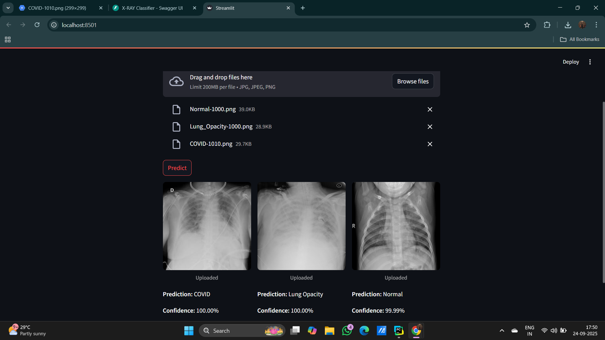

# X-RAY Classification using Deep Learning
## About the Project
This project is a deep learning-based image classification model designed to detect COVID-19, Normal, and Viral Pneumonia,Lung Opacity cases from chest X-ray images. It uses multiple models, ResNet and a custom CNN. The best-performing model, ResNet, achieved 98% accuracy.
## Deployed Application
The frontend is built using Streamlit
The backend is built using FastAPI
### Screenshot of the WebPage

## Dataset Details
The dataset consists of four classes:
COVID-19
Normal
Viral Pneumonia
Lung Opacity
The dataset was sourced from Kaggle. You can find it here: [Kaggle Dataset](https://www.kaggle.com/datasets/tawsifurrahman/covid19-radiography-database)
## Model Details
This project utilizes two different deep learning models:
ResNet (98% accuracy)
Custom CNN model

## Instructions to Reproduce
1. Clone the repository:
   ```bash
   git clone https://github.com/bhavyathatavarthi/X-Ray-Classifier
   cd X-Ray-Classifier
2. Create a virtual environment:
   ```bash
   python -m venv venv
   source venv/bin/activate  # On Windows, use `venv\Scripts\activate`
3. Install Requirements:
   ```bash
   pip install -r requirements.txt
4. To Run API:
   ```bash
   uvicorn api.xray_app:app --reload
5. Streamlit:
   ```bash
   cd api
   streamlit run streamlit.py
   ```
    
